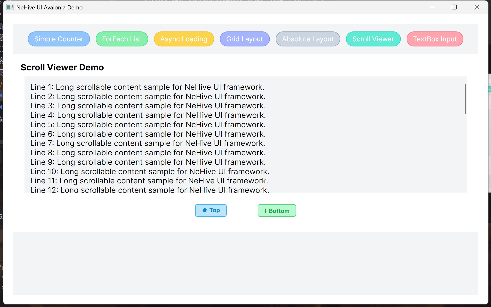

[](README.md)
[](./docs/README-zh.md)

# NeHive
## .NET Fine-Grained Reactive Runtime + Functional Cross-Platform UI Ecosystem

[](https://www.nuget.org/packages/NeHive.Reactive)
[](LICENSE)
[]()

> Ditch INotifyPropertyChanged, ditch dependency properties, ditch XAML, ditch control inheritance  
> Inspired by SolidJS/Vue3's fine-grained reactivity, natively implementing **Signal-driven + Function Component** development paradigm in .NET

---

## 🔭 Overall Architecture
NeHive consists of three core modules, decoupled and each with its own responsibilities:

- **NeHive.Reactive**  
  Lightweight, high-performance single-threaded reactive runtime  
  Signal / MutSignal / Computed / Effect / AsyncMemo / ReactiveFlow / ListStore  
  No reflection, low GC, automatic Scope lifecycle management to prevent memory leaks.

- **NeHive.UI.Avalonia**  
  **Pure functional declarative UI framework** built on Avalonia  
  No XAML, no custom control inheritance, pure C# UI construction  
  Built-in layout, basic controls, Tailwind-style atomic styling,  
  Control flow components: `ForEach` / `Show` / `Switch` / `Loading`.

- **NeHive.Generator**  
  Source generator that simplifies reactive boilerplate code and component template writing.

---

## ✨ Core Concepts & Differentiators
- ⚡ **Fine-grained reactive updates**  
  Precise dependency tracking, only update changed nodes, no full re-renders.
- 🧩 **Pure function components**  
  No need to inherit Control, no code-behind bindings – components are just pure functions.
- 📝 **Zero XAML**  
  Fully strongly-typed C# declarative UI, compile‑time safety and IDE IntelliSense.
- 🎨 **Atomic string styles**  
  Tailwind‑like syntax, say goodbye to verbose Styles/Setters.
- 🧭 **Scope‑based lifetime management**  
  Unified management of state, subscriptions, and component lifecycle, naturally leak‑free.
- 🌍 **Native cross‑platform**  
  Built on Avalonia – write once, run on Windows / macOS / Linux / WASM / mobile.

---

## 📦 Project Modules

| Module                                                     | Description                                              | Status            |
|------------------------------------------------------------|----------------------------------------------------------|-------------------|
| [`package/NeHive.Reactive`](package/NeHive.Reactive)       | Fine-grained reactive runtime for .NET                   | Public Preview    |
| [`package/NeHive.UI.Avalonia`](package/NeHive.UI.Avalonia) | Experimental functional UI framework built on Avalonia   | Experimental      |
| [`package/NeHive.Generator`](package/NeHive.Generator)     | Source generator for reactive boilerplate simplification | Early Development |
| [`samples`](samples)                                       | Console & Avalonia sample projects                       | Active            |
---

## 🚀 Use Cases
- Avalonia desktop development without XAML or traditional binding maintenance
- Cross‑platform apps requiring high‑performance fine‑grained state updates
- Systems with complex business logic needing componentization and centralized state management
- Writing native .NET applications using Solid/Vue reactive mindset

---

## 👀 Preview Example

### Sample Code

#### Simple counter
```csharp
private static IElement CounterComp(int id, UiScope uiScope)
{
    Console.WriteLine($"Counter {id} is creating");
    var count = new MutSignal<int>(0);
    var countText = () => $"Count: {count.RxValue}";

    var rootElement = uiScope.RootElement(new()
    {
        HTextBlock($"Id: {id}",
            strStyle: "text-lg font-bold fg-sky-200"
        ), // HTextBlock

        HTextBlock(countText,
            strStyle: "text-2xl fg-lime-300"
        ), // HTextBlock

        HButton("Add",
            strStyle: """
                      mt-1 ml-2 px-2 py-1 fg-white
                      bg-green-300 hover:bg-green-400 click:bg-green-500
                      border-w-1 border-green-400 rounded-lg
                      """,
            onClick: _ => count.RxValue++
        ), // HButton

        HButton("Sub",
            strStyle: """
                      mt-1 ml-2 px-2 py-1 fg-white 
                      bg-pink-300 hover:bg-pink-400 click:bg-pink-500
                      border-w-1 border-pink-400 rounded-lg
                      """,
            onClick: _ => count.RxValue--
        ) // HButton
    }); // rootElement

    uiScope.OnDispose += () => Console.WriteLine($"Counter {id} disposed");
    return rootElement;
}

public static IElement Counter(int prop)
    => Element.WithScope(CounterComp, prop);
```

#### Asynchronous component
```csharp
private static IElement LoadingDemoComp(UiScope uiScope)
{
    var userId = new MutSignal<int>(1);

    var userMemo = uiScope.CreateReactiveFlow(userId)
        .Debounce(500)
        .Filter(id => id > 0)
        .Map(id => new User(id, $"User {id}"))
        .PushAsyncMemo(async user =>
        {
            await Task.Delay(500);
            return user;
        }, initValue: new User(0, "Unknown"));

    var rootElement = uiScope.RootElement(new()
    {
        HStackPanel(new(strStyle: "mb-4 horizontal gap-3")
        {
            HButton("Increase User Id",
                strStyle: "px-3 py-1 bg-blue-400 fg-white rounded-lg",
                onClick: _ => userId.RxValue++
            ), // HButton
            HButton("Decrease User Id",
                strStyle: "px-3 py-1 bg-slate-400 fg-white rounded-lg",
                onClick: _ => userId.RxValue--
            ) // HButton
        }), // HStackPanel

        Loading<User>(new(userMemo)
        {
            Success = user => HChildren(
                HTextBlock($"User Id: {user.Id}", strStyle: "mt-1.5 text-lg"),
                HTextBlock($"Hello, {user.Name}", strStyle: "mt-1.5 fg-sky-600")
            ), // Loading<User>.Success
            Loading = _ => HTextBlock("Fetching user data...", strStyle: "fg-gray-500"),
            Error = ex =>
                HButton($"Retry: {ex.Message}",
                    strStyle: "mt-2 px-3 py-1 bg-rose-400 fg-white rounded-lg",
                    onClick: _ => userMemo.Refetch()
                ) // HButton
            // Loading<User>.Error
        }) // Loading<User>
    }); // rootElement

    return rootElement;
}

public static IElement LoadingDemo()
    => Element.WithScope(LoadingDemoComp);
```

#### Reference component
```csharp
private static IElement ScrollDemoComp(UiScope uiScope)
{
    var sb = new StringBuilder();
    for (var i = 1; i <= 40; i++)
    {
        sb.AppendLine($"Line {i}: Long scrollable content sample for NeHive UI framework.");
    }

    var longText = sb.ToString();

    var rootElement = uiScope.RootElement(new(strStyle: "m-4 flex-col")
    {
        HTextBlock("Scroll Viewer Demo", strStyle: "text-lg font-bold"),

        HScrollViewer(out var scroll, new(
            horizontalScrollBarVisibility: ScrollBarVisibility.Hidden,
            verticalScrollBarVisibility: ScrollBarVisibility.Auto,
            strStyle: "m-2 h-60 p-3 vertical bg-gray-100 rounded-xl border border-gray-300")
        {
            HTextBlock(longText, strStyle: "text-base")
        }), // HScrollViewer

        HStackPanel(new(strStyle: "my-4 gap-x-16 flex-row justify-center")
        {
            HButton("⬆️ Top",
                strStyle: "px-3 py-1 font-bold fg-sky-600 bg-sky-200 border-sky-400 rounded",
                click: _ => ScrollToHome()
            ), // HButton
            HButton("⬇️ Bottom",
                strStyle: "px-3 py-1 font-bold fg-green-600 bg-green-200 border-green-400 rounded",
                click: _ => ScrollToEnd()
            ) // HButton
        }) // HStackPanel
    }); // rootElement
    return rootElement;

    void ScrollToHome()
    {
        scroll.ScrollToHome();
    }

    void ScrollToEnd()
    {
        scroll.ScrollToEnd();
    }
}

public static IElement ScrollDemo()
    => Element.WithScope(ScrollDemoComp);
```

### Result Preview


---

## 📄 License
MIT
